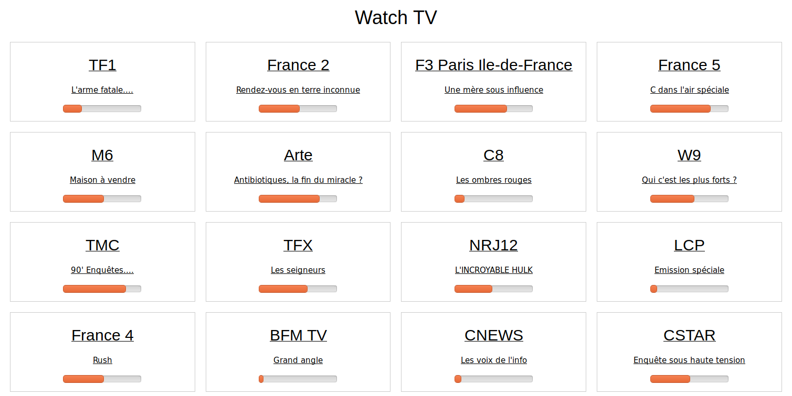

# Watch TV
This is a small server that allows you to watch digital television on your computer and your local network.



## Features
* scan and configure TV channels
* browse your TV channels from a web browser
* view current EPG while browsing channels
* stream tv using RTSP 1.0
* Kodi support, see [below](#kodi)
* watch simultaneously all channels in the same multiplex
* logical channel numbering (please note that this is not standard and may depend on your country)

## Is is compatible in my country?
Use [this map](https://fr.wikipedia.org/wiki/DVB-T#/media/File:Digital_terrestrial_television_standards.svg) to know your broadcasting technology.
* **This has been developed and tested on a DVB-T network only**, with MPEG-4 (H.264) streams.
* It will probably work on DVB-T2 (not tested yet).
* It may work on other networks (Cable, Satellite, ATSC), but it is yet untested.
* Please open an issue or merge request to report your success or failure to improve this software. 

## Status - 1.0 milestone
* It is working and functionnal
* Needs more testing before stable release
* Needs packaging for common linux distributions (at least Debian/Raspbian/Ubuntu)
* Needs DVBV5 stability fixes to be upstreamed

## Ideas for future releases
* browse whole electronic program guide (EPG) on the web interface (currently you can just view running EPG in the web page, full EPG is available with Kodi)
* live update web interface to reflect avaliable channels when a stream is already running
* multiple adapter support
* pause (live recording)
* scheduled recording
* remote
* performance improvements (starting a channel is way too slow)
* watch TV directly in the browser with HTTP_Live_Streaming
  * https://en.wikipedia.org/wiki/HTTP_Live_Streaming
  * https://tools.ietf.org/html/rfc8216

## Requirements
You can run the server and the client on the same device if you want.

### Client
* Must be powerful enough to decode TV streams, that will probably be MPEG 2 (H.262) or MPEG 4 (H.264) or MPEG H (H.265).
* Desktop:
  * [MPV](https://mpv.io/) (recommended)
  * [MPlayer](http://www.mplayerhq.hu)
  * [VLC](https://www.videolan.org/vlc): expect troubles with VLC
    * TCP does not work with VLC (it is supported but I didn't manage to make it work)
    * UDP is the default and works, but glitches are expected, probably because TS stream should be converted to RTP? (if you know well RTSP and RTP please feedback wanted)
  * <a name="kodi"></a>[Kodi](https://kodi.tv/) using [IPTV Simple Client](https://kodi.wiki/view/Add-on:IPTV_Simple_Client) You can copy m3u and epg URLs from main channels page (links at bottom). I highly recommend you disable caching channels in IPTV plugin configuration **and** in kodi PVR settings 
* Android
  * [MPV-android](https://play.google.com/store/apps/details?id=is.xyz.mpv) (recommended)
  * [VLC for Android](https://play.google.com/store/apps/details?id=org.videolan.vlc) (same limitations as VLC for desktop)
* Web browser if you want to lauch channels from it

### Server
* Linux
* PHP 7+
* A TV adapter
* ethernet network. Wifi works but please avoid wifi: **wifi is not that reliable**. I do not recommend you use wifi for the server side.

This is compatible with raspberry pi, but note that there is a bug that WILL crash your raspberry sooner or later. Please wait for bug resolution before using this on your raspberries: [bug report](https://bugs.launchpad.net/raspbian/+bug/1819650)

A raspberry zero-w is enough, although I recommend you something more reliable:
* the raspberry zero will be pushed at it's own limits (expect 80% to 100% CPU)
* it has wifi only (you may try USB attached ethernet adapter)
* some TV dongles require a lot of current, and some power supplies don't handle this corectly
* Raspberry pi does not have a reliable wifi (at least raspberry-zero and raspberry 3B have wifi troubles - raspberry 3B+ seems not to be affected). Discussion [here](https://www.raspberrypi.org/forums/viewtopic.php?f=28&t=188891&sid=afdef6524bddc08ec983fe57bb3a797c) and [here](https://www.raspberrypi.org/forums/viewtopic.php?f=36&t=234058)

## Installation

1. Install requirements
    Ubuntu / raspbian
    ```shell
    $ sudo apt install php-cli dvb-tools
    ```
    Debian (run as root)
    ```shell
    # apt install php-cli dvb-tools
    ```
2. Download latest release package from https://github.com/phpbg/watchtv/releases
3. Extract it
    ```shell
    $ tar xf watchtv-0.6.0.tar.gz
    ```
3. Test the server manually
    ```shell
    $ cd watchtv
    $ php server.php
    ```

## Installing as a service with systemd
If you want the server to start automatically at boot, install it as a service.
1. edit `watchtv.service`
    * fix `ExecStart` path
    * set `User` and `Group`
2. copy `watchtv.service` to `/etc/systemd/system/`
    ```shell
    $ sudo cp watchtv.service /etc/systemd/system/
    ```
3. Reload systemd daemon
    ```shell
    $ sudo systemctl daemon-reload
    ```
4. Start the service
    ```shell
    $ sudo systemctl start watchtv
    ```
5. Enable the service at boot
    ```shell
    $ sudo systemctl enable watchtv
    ```
To check logs run `$ journalctl -u watchtv`
   
## FAQ
### Is my TV adapter compatible
See [here](https://www.linuxtv.org/wiki/index.php/Hardware_device_information) for a complete list of DVB digital devices that **should** be compatible.
Tested:
  * TerraTec Cinergy T Stick+: OK
  * RTL SDR v2: OK but some glitches appears after a few hours (when the dongle is hot)
  * [Raspberry TV HAT](https://www.raspberrypi.org/blog/raspberry-pi-tv-hat/) **should** work. If you have one please open an issue or a merge request to report the status (try to run it for many hours to check longterm stability). Note: this device use [SPI at 55Mhz](https://patchwork.kernel.org/patch/10003465/#21035387). I don't know yet if this is sufficient to watch *all* channels within a multiplex...
  
### Horizontal lines (more or less visible) on image
Your video may be interlaced.

With mpv, try pressing `d` to activate deinterlace

If it works, you can make it permanent with `deinterlace=yes` in `~/.config/mpv/mpv.conf`

## Contributions
After cloning the project run:

    git submodule init
    git submodule update

Build a release

    #Make sure log level is set to INFO in server.php
    composer install --no-dev --optimize-autoloader
    cd ..
    tar --exclude='watchtv/.git' --exclude='watchtv/.idea' --exclude='watchtv/channels.conf' -czf watchtv.tar.gz watchtv/